# IDEA-X

| WELCOME TO IDEA-X |

 ---------------
| Introduction |
 ---------------

IDEA-X is a social media for engineers that explore and share their exceptional Ideas with others. IDEA-X is a C# based web application. Sharing innovative thoughts and photos with mates is easy with IDEA-X now. Add new mates, keep track of daily activities and support gratest ideas that you appreciate. Admin and UAC will monitor and control all harmful activities to ensure users' freedom.

Thank you everyone.

>> YouTube video link:

-------------------
| Required System |
-------------------

 >> Any version of windows operating system which is compatible to run Microsoft Visual Studio.
 >> Microsoft Visual Studio 2019
 >> Microsoft SQL Server Management Studio

--------------------------
| Minimum Specifications |
--------------------------

    1. Operating System : Windows® 7/8/10/11
    2. Processor	: Intel® Core™ i3
    3. Memory		: 2 GB RAM
    4. Graphics		: Not Required
    5. Network		: Broadband Internet Connection
    6. Storage		: 1.5 GB

---------------------------
| How to run [Using .sln] |
---------------------------

 >> Open "SQL Server Management Studio" and connect your device to server.
 >> Click on "New Query" option, paste the statement "CREATE DATABASE IDEA_X" and Execute it.
 >> Open "IDEA-X" file and copy the sql queries from "IDEA-X_Query.txt" file.
 >> Go to "SQL Server Management Studio", click on database "IDEA_X", Execute the sql queries.
 >> Connect your device to server and copy the server name.
 >> Open "RAW.sln" in Microsoft Visual Studio.
 >> Go to "View" and click on "Solution Explorer" option or only press "Ctrl+Alt+L".
 >> Open "Models" folder and click right button of "EntityFramework" folder.
 >> Select "New Item" of "Add" option.
 >> Open "Visual C#", select "Data", keep the default option and press "Add".
 >> Go to Next and select "New Connection".
 >> Paste the server name in the box, select database "IDEA_X" from options and press OK.
 >> After that paste "IDEA_XEntities" in the below box and press Next.
 >> Make sure you are checking the "Tables" option and press "Finish".
 >> Finally, IDEA-X is ready to Run. Click the run button to get access of "IDEA-X".

-----------------------
| How to use "IDEA-X" |
-----------------------

 >> First, make sure your screen size is '100%'.
 >> To explore IDEA-X, at first you must Sign up with proper information.
 >> For entering email, a valid email is required.
 >> To verify yourself you must enter the OTP.
 >> For mobile number, you have to give a valid mobile number. 
 >> You must fill all the required field.
 >> After Sign up, Log in to your profile and share Ideas!
 >> There are 3 different users: User, Admin & User Access controller(UAC).

   User :
      
           1. Timeline                     - All user's posts are shown here. User can report any post and search particular post from search box.
	   2. Profile                      - User can view details and change password if needed.
           3. Activities                   - Track Upvote and Downvote activities of post through graph, pie chart and percentage.
           4. User Timeline                - User can post from this and only user's post is shown here.
           5. Chat                         - Search mates and send request to communicate with them.
           6. Idea Tracker                 - Select dates from the calendar and track daily activities by keeping notes. 
	   

   Admin :

           1. Timeline                     - All user's posts are shown here. Admin can ban any post and search particular post from search box.
	   2. Profile                      - Admin details is given here. Can change password and search other users profile.
           3. Monitoring                   - Track activities view and search user logins, user details, post actions, chat sessions and other post details. Admin can export data and keep track of Users.
           4. Post Reports                 - All pending, investigating and closed reports are shown here.
           5. Contact Us                   - Admin solves any issues of user. Pending and Solved messages are given here. 
           6. User Access Controller       - UAC(User Access Controller) is added by Admin. Search and view all UAC details.

         
   UAC :
           
           1. Timeline                     - All user's posts are shown here. UAC can ban any post and search particular post from search box.
	   2. Profile                      - UAC details is given here. Can change password and search other users profile.
           3. Post Reports                 - All pending, investigating and closed reports are shown here.
          
         
 >> There are some other options for IDEA-X Users.

   IDEA-X Options:

           1. About                        - This will give a brief description of IDEA-X features. 
           2. Meet The Team                - To know about developers here is meet the team.
           2. Contact Us                   - Contact with admin for any issue. IDEA-X has different sections for registered and non-registered users. 
           3. Feedback                     - Feedback will help to improve the system and serve the user better.
           4. Report                       - If user faces any problem using the system, reporting will help.

---------------------------
| Background Informations |
---------------------------

Human is a social beings. To survive in the recent world people need to communicate with others. He/She can share Ideas through which knowledge is exchanged among people, friends, peers, families, communities, or within or between organizations. It bridges the individual and organizational knowledge thus leading to the sustained competitive advantage of companies.

Apart from traditional face-to-face Idea sharing, social media is a good tool because it is convenient, efficient, and widely used. Organizations have recognized that knowledge constitutes a valuable intangible asset for creating competitive advantages. The sharing of knowledge constitutes a major challenge in the field of knowledge management.

From this point onward, "IDEA-X" is introduced to share uniquer thoughts for engineers. Through this system sharing Ideas is now more easy.

----------------------------
| Developer's Informations |
----------------------------

	 1. Niloy Kanti Paul
	    Email	: niloykantipaul@gmail.com
	    LinkedIn	: https://www.linkedin.com/in/niloy-kanti-paul-5543181ab/
	    Github	: https://github.com/DEV-NKP

	 2. Kaushik Biswas
	    Email	: biswaskaushik.2020@gmail.com
	    LinkedIn	: https://www.linkedin.com/in/kaushik-biswas-2b6554243/
	    Github	: https://github.com/Kaushik-Biswas

	 3. Dipanwita Saha
            Email	: dipanwitasaha7009@gmail.com
	    LinkedIn	: https://www.linkedin.com/in/dipanwita-saha-a772aa215/
	    Github	: https://github.com/Dipanwita-Saha+
         
	 3. Anindra Das Bivas
            Email	: 
	    LinkedIn	: 
	    Github	: 

----------------------
| Project Highlights |
----------------------

> IDEA-X has an organized and outstanding landing page with a short overview of it.
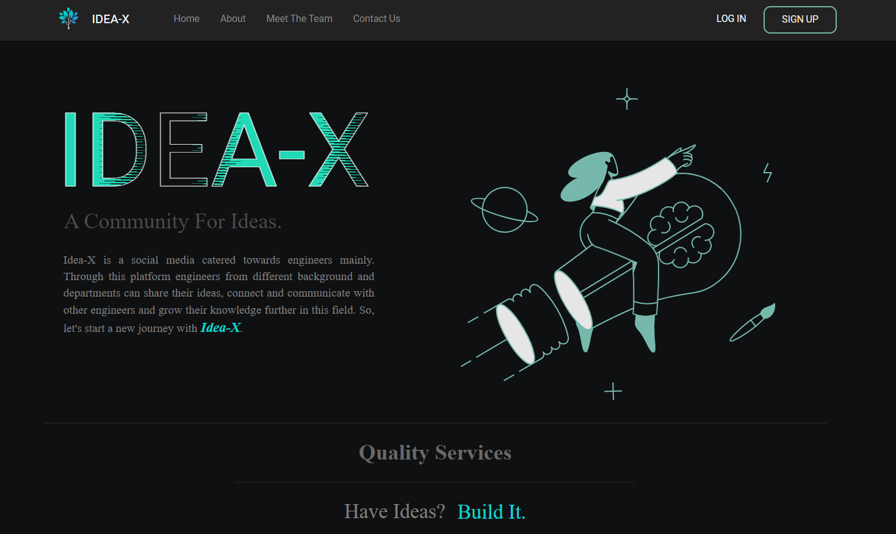

> If you are new here, Sign Up through this form.
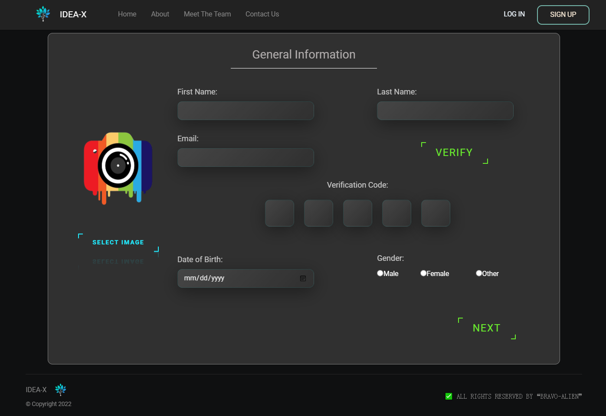

> Log In to IDEA-X and explore new inventions!
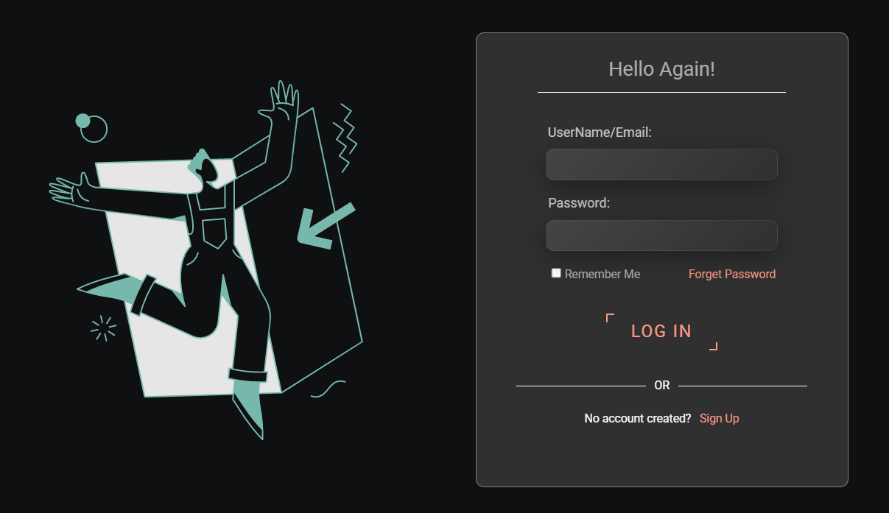

> User details are shown in Profile section which can be editable. 
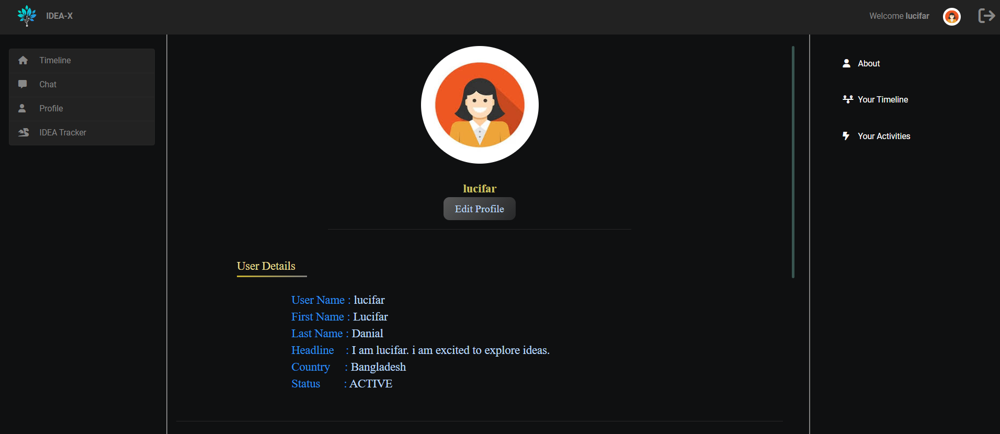

> General timeline is common for all Users. To show opinion toward any post just press the Upvote or Downvote button.
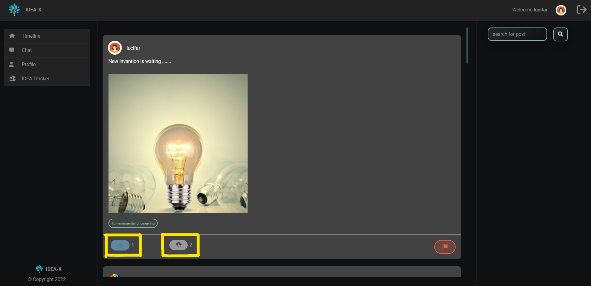

> All Users have their personal timeline where they can post new Ideas.
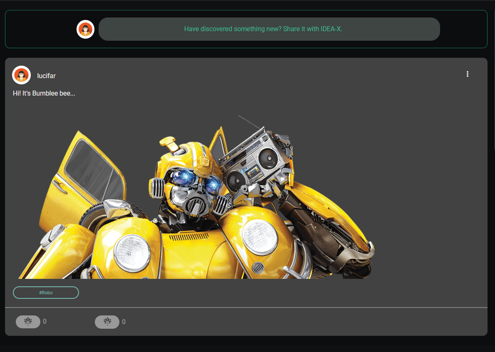

> After reporting, the reported post is identified with this red sign.
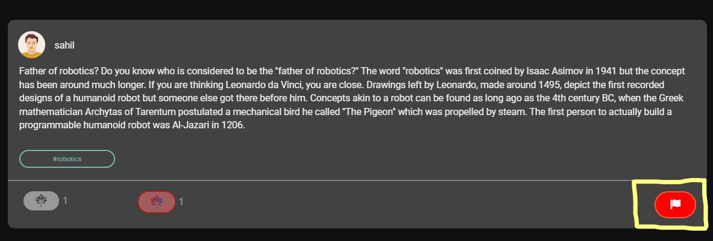

> For any unusual post, report the post through this form with proper reason.
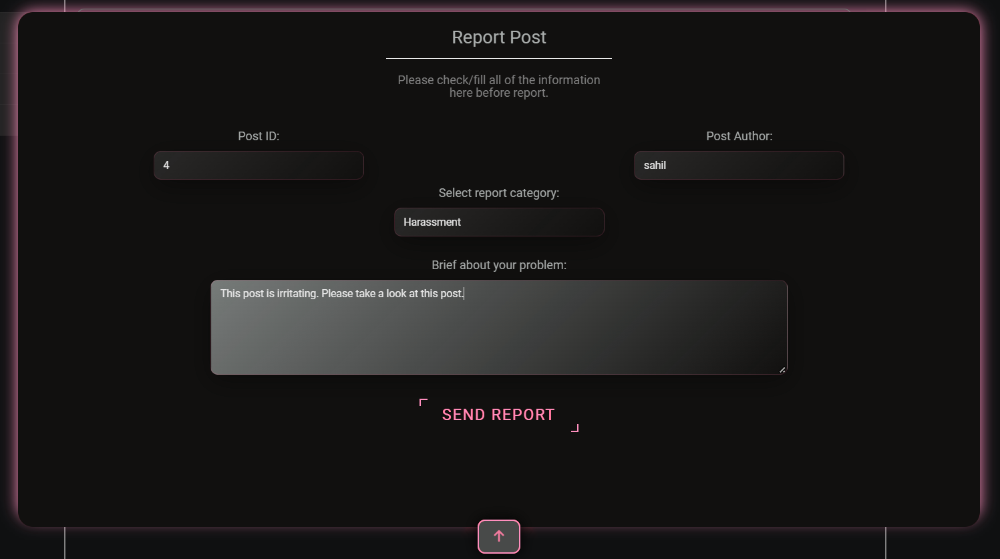

> If user mistakenly reports any post, he/she can revoke it.

> The daily routine tracker is one of the unique features of IDEA-X. Get updated every day by keeping quick notes!
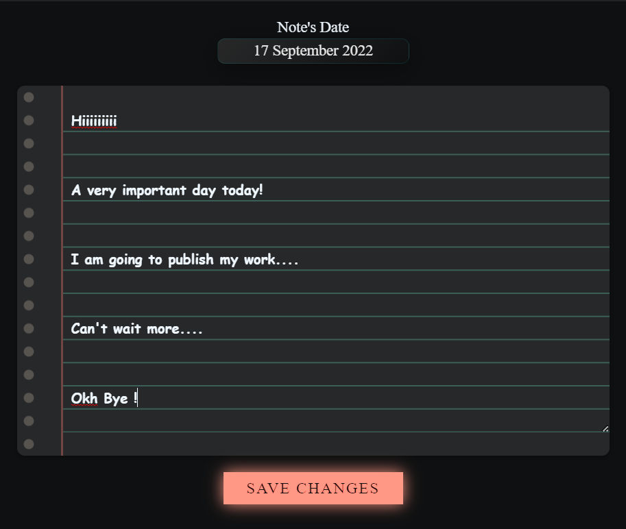

> A convenient calendar to keep notes on specific days is also provided by the IDEA tracker.
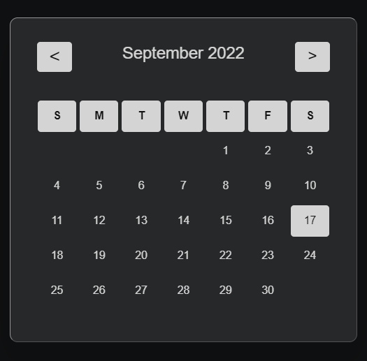

>> Users can search for mates and send request to make communication.
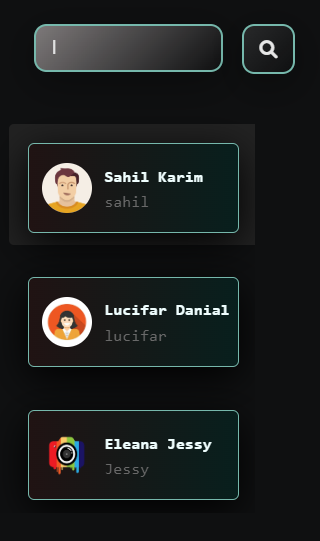

> Communicate with mates throught chat and get to know each other.
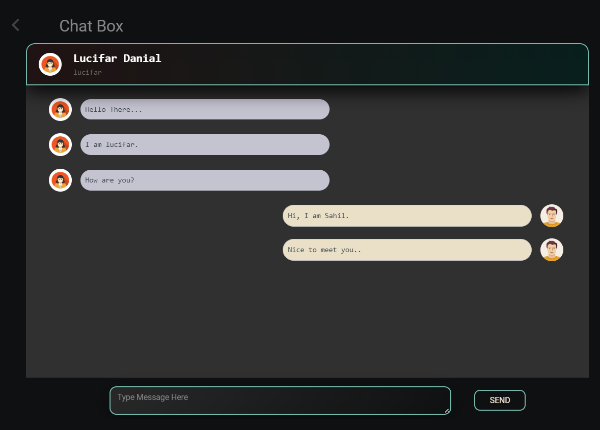

> Total Upvote and Downvote percentages of posts are shown in a collective way.
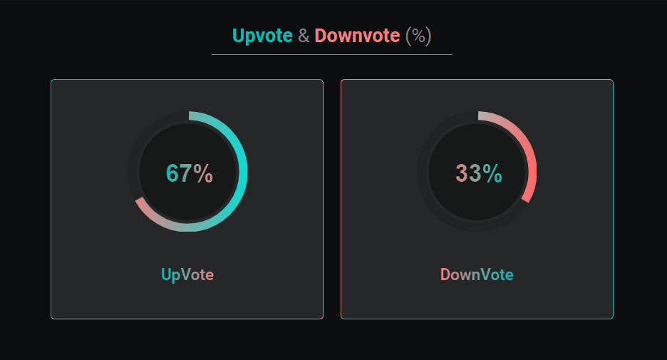

> Users can keep track of Upvoting or Downvoting persons of his/her post.
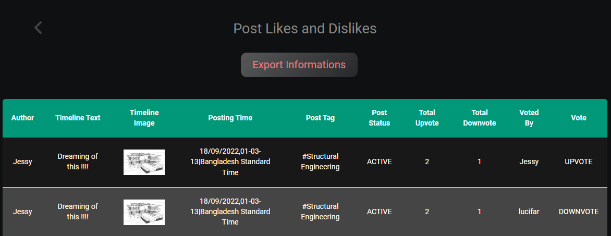

> A graph of 100 recent posts is in the Activities section, which the User will find interesting.
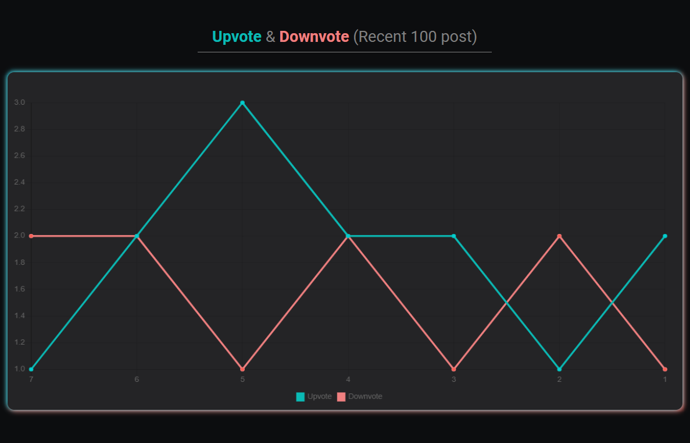

> To investigate reports there are UAC(user Access Controler) who is added by Admin.
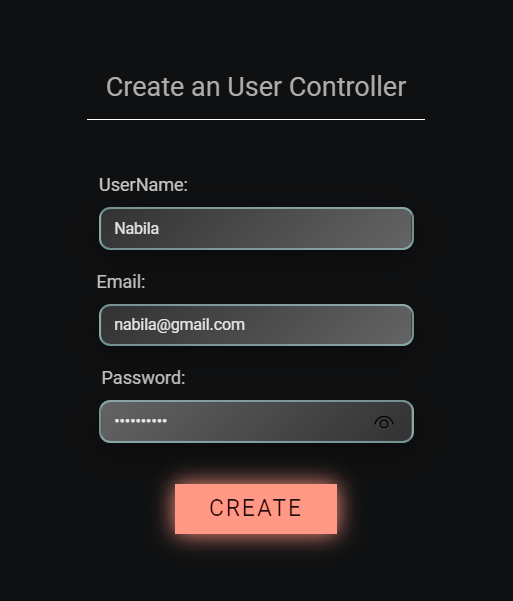

> Admin can ban any disturbing post. A red tag is marked to identify banned posts.

> To know more about IDEA-X features visit About page.
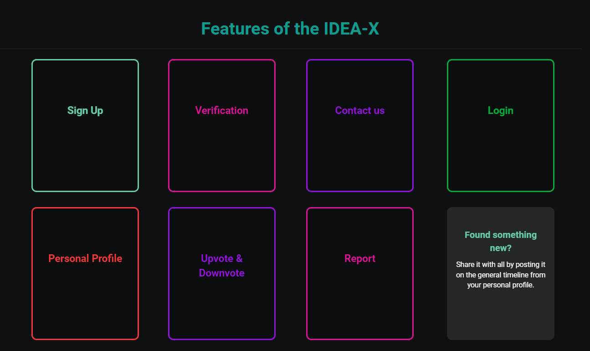

> There are two different sections to contact with Admin.
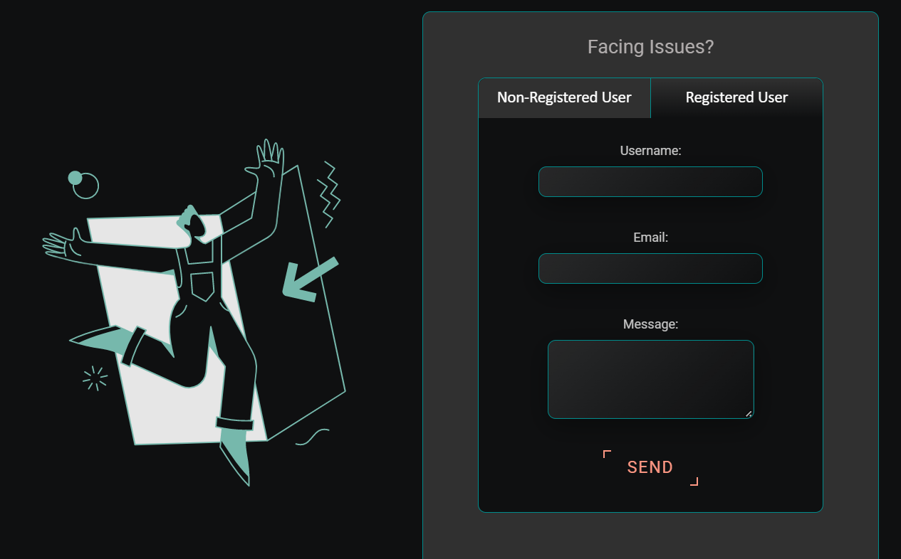

> IDEA-X has a remarkable designed logo.
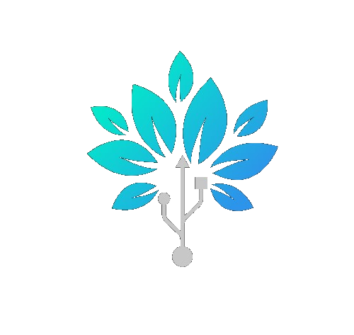

********************************************ⒸAll Rights Reserved By team "BRAVO-ALIEN"********************************************

